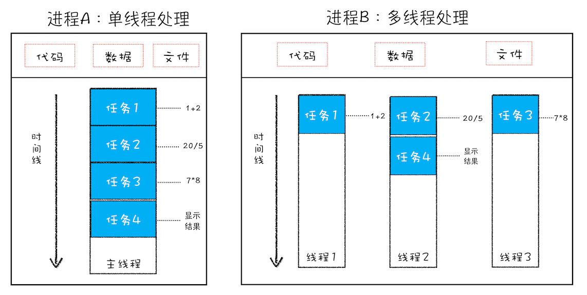

# 宏观视角下的浏览器

### 1. 进程与线程

所谓**进程就是一个程序的运行实例**，在程序启动时操作系统会为该程序创建一块内存，用来存放代码、数据和一个执行任务的主线程。而**线程是由进程来启动和管理的，线程不能单独存在**。

在进程中可以通过调用一个或多个线程来实现所谓的单线程或多线程

</img>

<Detail>
<Summery>进程和线程之间的关系</Summery>

1. 进程中的任意一线程执行出错，都会导致整个进程的崩溃
2. 线程之间共享进程中的数据
3. 当一个进程关闭之后，操作系统会回收进程所占用的内存
4. 进程之间的内容相互隔离
</Detail>
